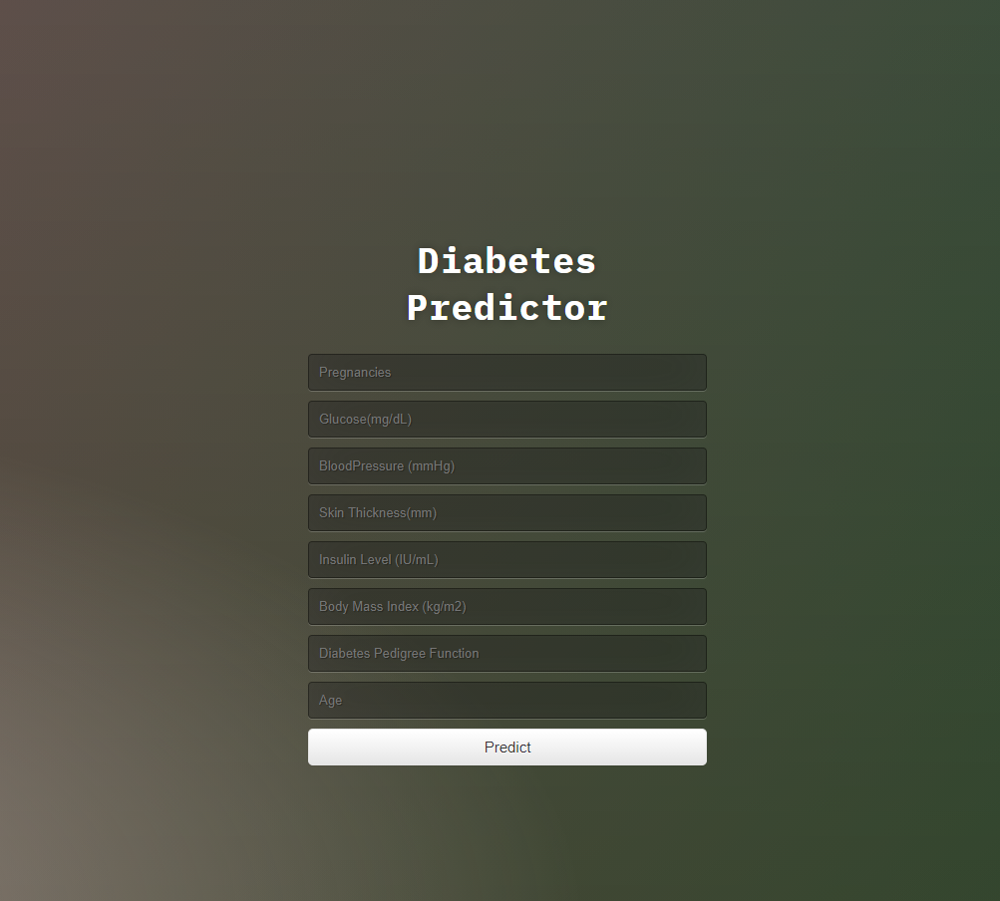
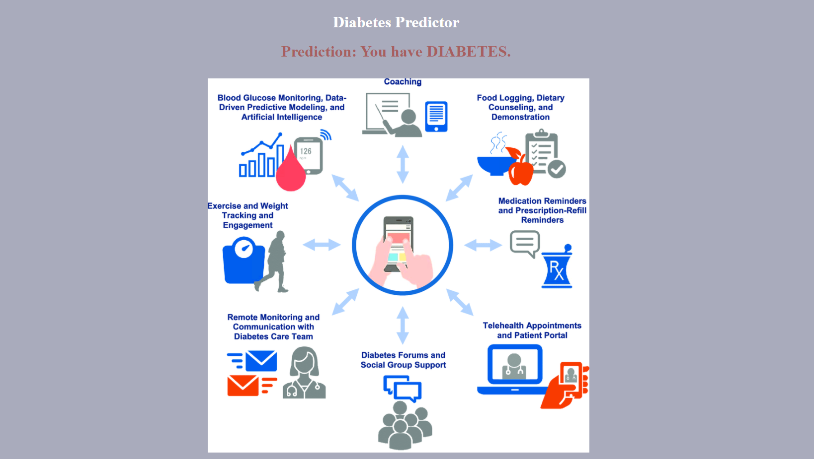
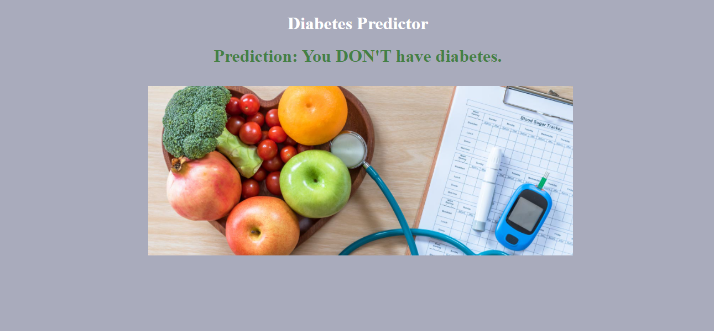

# `Early Stage Diabetes Prediction`
Today, diabetes is one of the popular, chronic, and deadly diseases for complications. Early diagnosis of diabetes is crucial for timely treatment as it can stop the progression of the disease. However, it can not only predict the occurrence of future diabetes, but also help reveal the problem experienced by the experiment. An estimation about the estimation is aimed by logistic regression method over this source data set. The improved version of the study is achievable, but it has been seen that higher accuracy values can be reached with different methods


## Tech and Libraries

- Logistic Regression
- Pandas
- Numpy
- Sklearn
- Scikit learn
- Flask
- Matplotlib


## Dataset

 - [Pima Indians Diabetes Database](https://www.kaggle.com/datasets/uciml/pima-indians-diabetes-database?datasetId=228)

## API Reference

#### Index Page - Submit Form

```http
  GET /
```

| Parameter | Type     | Description                |
| :-------- | :------- | :------------------------- |
|  | `index.html` | Submit form for prediction values. |

#### Result Page

```http
  POST /predict
```

| Parameter | Type     | Description                       |
| :-------- | :------- | :-------------------------------- |
|       | `results.html` | Diabetes prediciton result page. |


## Screenshots

|  |
| :--:|
| *Values for Prediction Form* |

|  |
| :--:|
| *Prediction Result is Diabetes Page* |

|  |
| :--:|
| *Prediction Result is No Diabetes Page* |
